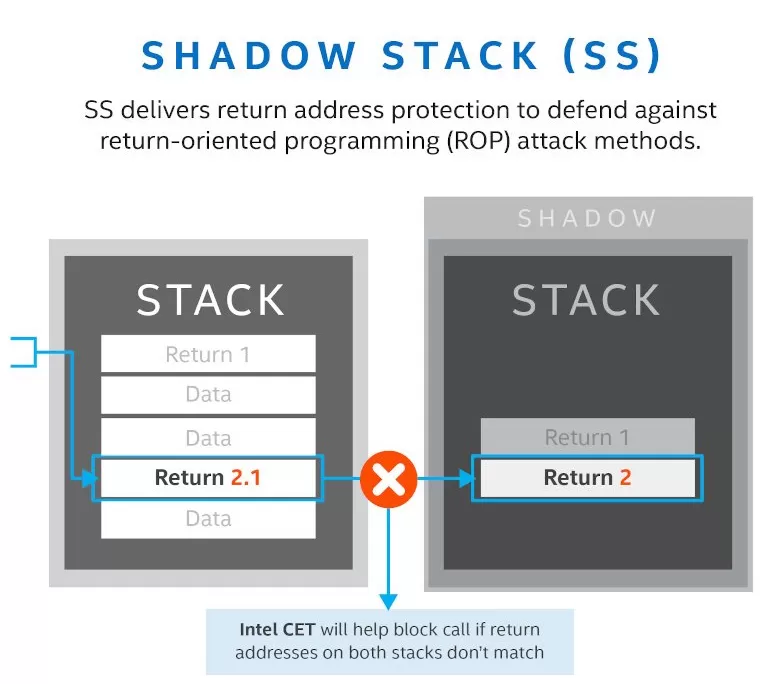
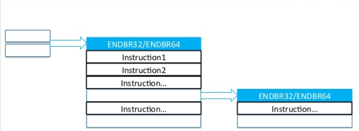
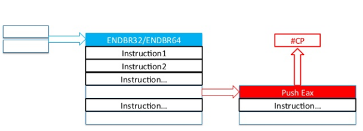

## Introduction and Motivation

Intel CET는 Intel사에서 개발한 제어 흐름 적용 기술(Control-flow Enforcement Technology)이다. 많은 보안 위협에 대응하기 위해 현대에 오면서 stack에 실행 권한을 없애거나 code page에 쓰기 권한을 없애 보안성을 강화시켰지만, 공격자들은 메모리에서 실행되는 기존 코드를 이용하여 프로그래머가 의도하지 않은 방향으로 프로그램이 흘러가도록 하는 ROP, JOP와 같은 기술을 사용하여 악성 코드 흐름을 결합한다. 이러한 제어 흐름 하이재킹을 방지하도록 하기 위하여 제어 흐름 기술을 도입한 것이다.

이러한 CET는 다음과 같은 4가지의 목표를 가진다. ROP/COP/JOP로부터 보호하기 위한 SW 친화적인 ISA, 애플리케이션 개발자에게 최소한의 영향을 미치는 포괄적인 솔루션, OS / 개발 도구 및 런타임을 통한 광범위한 지원, 허용 가능한 성능 및 에너지 사용량에 대한 영향을 고려한다.

이러한 목표들을 방향 삼아 프로그래머가 의도하지 않은 실행 흐름 변경에 대한 보호를 강화하는 두 가지 메커니즘을 가진다. 하나는 ROP에 대항하는 Shadow Stack 이고 다른 하나는 JOP에 대항하는 간접 분기 추적(indirect branch tracking)이다.

---

 

## Shadow Stack

Shadow Stack은 반환 주소 변조를 보호하기 위한 스택이다.따라서 반환 주소 변경이 필수적인 ROP공격에 대해 강력한 방어를 제공한다. 쉐도우 스택은 가장 최근에 생성된 반환 주소를 저장하기 위한 하드웨어 버퍼, 버퍼 항목과 타겟 주소를 비교하는 로직으로 구성된다.

{: width="500px"}

Shadow Stack의 동작은 다음과 같다.

함수 호출(call)이 발생하면 반환 주소를 Shadow Stack에 push를 한다. 그 후, 함수를 반환할 때 stack과 shadow stack에 저장된 주소를 비교하여 해당 함수의 ret 주소가 변조되었는지 판단할 수 있다.

이 보호기법을 위해 윈도우에서는 아래와 같은 새로운 명령어들을 사용한다.

- INCSSP : shadow stack pointer를 증가.
- RDSSP : shadow stack pointer를 읽음.
- SAVEPREVSSP, RSTORSSP : 이전 shadow stack pointer를 저장하거나 가져옴.
- WRSS, WRUSS : shadow stack에 값을 씀.
- SETSSBSY, CLRSSBSY : shadow stack이 busy 상태인지 clear 상태인지 flag를 마킹함.

하지만 Shadow Stack에는 몇 가지 단점이 있다. Shadow Stack이 사용자의 주소 공간에 존재하여, 엑세스에 많은 사이클이 소요되어 오버헤드가 발생할 수 있으며, 또한 사용자는 RW권한을 가지기 때문에 공격자도 접근이 가능하여 Shadow Stack에 들어간 자체의 값을 변조시키는 Bypass가 일어날 수 있다.

---

 

## IBT (Indirect Branch Tracking)

점프 지향 프로그래밍(JOP)과 같은 기법들은 공격자가 간접 분기에 사용되는 변수를 어떻게든 손상시킬 수 있는 경우 커널의 실행 흐름을 임의의 위치로 리디렉션할 수 있다. 이로 인해 의도하지 않은 함수 호출이 발생할 수 있다. 
x86과 같은 복잡한 프로세서에서는 멀티바이트 명령어 중간으로 점프하여 공격자가 원하는 결과를 얻어낼 수 있다. IBT의 경우 이런 JOP에 대한 방어를 수행한다.

Intel의 IBT의 경우 하드웨어적인 지원을 하기 때문에 빠른 속도를 자랑한다. 이 보호기법에서는 endbr32 / endbr64 (endbranch)라는 새로운 명령어를 사용하게 되며 CET를 지원하지 않는 프로세서에서는 NOP으로 처리된다. 
IBT가 활성화된 경우 CPU는 모든 간접 분기가 무작동으로 실행되는 특수 명령어( endbr32 또는 endbr64 )에 도달하도록 하며, 다른 것이 발견되면 프로세서는 제어 보호( #CP ) 예외를 발생시킨다.

이러한 IBT는 ROP나 JOP에서 code gadget를 사용하지 못하도록 하여 방어를 할 수 있다. 하지만 이와 같은 메커니즘을 켜는 것은 간접 분기의 가능한 모든 대상이 endbr 명령 중 하나로 시작하는 경우에만 작동한다. 대부분의 경우 컴파일러의 옵션(GCC(GCC 9 기준)와 Clang(버전 14 기준) 모두 -fcf-protection=branch)를 이용하여 해당 매커니즘을 수행하여 IBT가 작동할 수 있도록 해주지만, 완벽한 작업을 보장하지 못하기 때문에 필요할 때마다 endbr 명령을 추가하는 것이 중요하다.

하지만 커널이 IBT를 염두에 두고 구축되지 않은 다른 사람의 코드를 호출할 때 또 다른 작은 문제가 발생한다. 
커널은 외부 코드를 자주 호출하지 않지만 특정한 경우 외부의 코드를 사용하게 된다면 안전을 위해 커널은 펌웨어 호출 시 IBT를 끄는 지점을 만들며, 구현(2022)에서는 사용자 공간에 대한 제어권을 부여할 때 IBT가 꺼진다. 

또한 모든 call이나 jmp에서 적용되는 내용은 아니고 몇 가지 예외는 존재하며 이는 far direct jmp (JMP DS:[mylabel], rip)에 의존적인 jmp, jcc (jump if condition is met) 명령어와 같은 부분이 있다.

---

 
 
 

Reference

- [메모리 보호 기법](https://core-research-team.github.io/2020-05-01/memory#7-cet-control-flow-enforcement-technology-specification)
- [Bypassing Return Flow Guard (RFG) &#8211; Eyal Itkin](https://eyalitkin.wordpress.com/2017/08/18/bypassing-return-flow-guard-rfg/)
- Processor Design with Code-Reuse Attack Defense Technique - 김갑경
- [LWN Blog](https://lwn.net/Articles/889475/)
