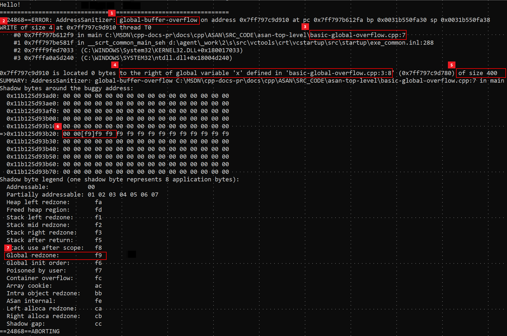

## **Address Sanitizer (ASan)**

컴파일러 및 런타임 기술. 거짓 양성이 없도록 하며 찾기 어려운 버그를 많이 탐지한다.

**Hard to find bug**

- [Alloc and dealloc mismatches](https://learn.microsoft.com/en-us/cpp/sanitizers/error-alloc-dealloc-mismatch?view=msvc-170)
- [Error: new-delete-type-mismatch](https://learn.microsoft.com/en-us/cpp/sanitizers/error-new-delete-type-mismatch?view=msvc-170)
- [Allocations too large for the heap](https://learn.microsoft.com/en-us/cpp/sanitizers/error-allocation-size-too-big?view=msvc-170)
- [calloc overflow]([Error: calloc-overflow](https://learn.microsoft.com/en-us/cpp/sanitizers/error-calloc-overflow?view=msvc-170)) and [alloca overflow]
- ([Error: dynamic-stack-buffer-overflow](https://learn.microsoft.com/en-us/cpp/sanitizers/error-dynamic-stack-buffer-overflow?view=msvc-170))
- [Double free](https://learn.microsoft.com/en-us/cpp/sanitizers/error-double-free?view=msvc-170) and [use after free](https://learn.microsoft.com/en-us/cpp/sanitizers/error-heap-use-after-free?view=msvc-170)
- [Global variable overflow](https://learn.microsoft.com/en-us/cpp/sanitizers/error-global-buffer-overflow?view=msvc-170)
- [Heap buffer overflow](https://learn.microsoft.com/en-us/cpp/sanitizers/error-heap-buffer-overflow?view=msvc-170)
- [Invalid alignment of aligned values](https://learn.microsoft.com/en-us/cpp/sanitizers/error-invalid-allocation-alignment?view=msvc-170)
- [memcpy](<https://learn.microsoft.com/en-us/cpp/sanitizers/error-memcpy-param-overlap?view=msvc-170>) and [strncat parameter overlap]
- [Error: strncat-param-overlap](https://learn.microsoft.com/en-us/cpp/sanitizers/error-strncat-param-overlap?view=msvc-170)
- [Stack buffer overflow](https://learn.microsoft.com/en-us/cpp/sanitizers/error-stack-buffer-overflow?view=msvc-170) and [underflow](https://learn.microsoft.com/en-us/cpp/sanitizers/error-stack-buffer-underflow?view=msvc-170)
- [Stack use after return](https://learn.microsoft.com/en-us/cpp/sanitizers/error-stack-use-after-return?view=msvc-170) and [use after scope](https://learn.microsoft.com/en-us/cpp/sanitizers/error-stack-use-after-scope?view=msvc-170)
- [Memory use after it's poisoned](https://learn.microsoft.com/en-us/cpp/sanitizers/error-use-after-poison?view=msvc-170)


또한 이 기능은

- 기본 정확성
- 플랫폼 간 이식성
- 보안
- 스트레스 테스트
- 새 코드 통합

을 지원하여 시간 단축을 이루어 낸다.


AddressSanitizer는 Visual Studio 프로젝트 시스템, CMake 빌드 시스템 및 IDE와 통합되며, 프로젝트는 프로젝트 속성을 설정하거나 하나의 추가 컴파일러 옵션을 **`/fsanitize=address`**사용하여 AddressSanitizer를 사용하도록 설정할 수 있다.

해당 글은 ASan 설치를 위한 글은 아니므로 건너뛰도록 하겠다.

<br />

---


## **예제 (Hard to find bug - Global variable overflow)**

```cpp
// basic-global-overflow.cpp

#include <stdio.h>
int x[100]; // index : 0 ~ 99.
int main() 
{
    printf("Hello!\\n");
    x[100] = 5; // Overflow : index = 100.
    return 0;
}
```

**실행 후 ASan 화면**



1. 메모리 안전 버그는 전역 버퍼 오버플로임.

2. 사용자 정의 변수 외부에 4바이트(32비트)가 저장됨**.**

3. 저장소는 7줄의 파일에 `basic-global-overflow.cpp` 정의된 함수 `main()` 에서 일어남.

4. 명명된 `x` 변수는 8열부터 3줄의 basic-global-overflow.cpp에 정의됨.

5. 이 전역 변수 `x` 의 크기는 400바이트임.

6. 저장소가 대상으로 하는 주소를 설명하는 정확한 [섀도 바이트](https://learn.microsoft.com/ko-kr/cpp/sanitizers/asan-shadow-bytes?view=msvc-170) 값은 임. `0xf9`
   
   **섀도 바이트 (Shadow Byte)**
   
   AddressSanitizer는 메모리의 각 바이트에 대응하는 '섀도 메모리'를 사용하여 프로그램의 메모리 접근을 추적한다. 각 섀도 바이트는 실제 메모리의 여러 바이트를 대표하며, 이 바이트의 값은 메모리가 어떻게 사용되고 있는지를 나타낸다. 예를 들어, 메모리가 사용 중일 때, 섀도 바이트는 **`0x00`** 값을 가지고, 사용 가능하지 않은 메모리 영역(예: 배열의 경계를 넘어서는 영역)은 다른 값을 가질 수 있다.
   
   **`0xf9` 값의 의미**
   
   섀도 바이트의 값 **`0xf9`**는 특정 메모리 영역이 주변의 유효한 메모리 영역과 인접해 있으나, 실제로는 사용할 수 없는 '부분적으로 사용 가능한 메모리 영역'을 나타낸다. 예를 들어, 배열이 할당된 메모리 블록의 경계에서 발생할 수 있는데, 배열의 마지막 요소 다음의 첫 바이트가 이 범주에 속할 수 있으며, 해당 예제의 경우가 이에 해당한다.

7. 그림자 바이트 범례는 오른쪽의 안쪽 여백 영역임. `0xf9` . `int x[100]`
   
   ASan 출력에서 그림자 바이트 범례는 메모리 덤프의 오른쪽 여백에 표시되며, 메모리 주소 및 해당 주소의 섀도 바이트 값과 함께 메모리의 상태를 설명해준다.

<br />

---

## **ASan으로 탐지할 수 있는 주된 오류들**

- [alloc-dealloc-mismatch](<https://learn.microsoft.com/en-us/cpp/sanitizers/error-alloc-dealloc-mismatch?view=msvc-170>)
- [allocation-size-too-big](<https://learn.microsoft.com/en-us/cpp/sanitizers/error-allocation-size-too-big?view=msvc-170>)
- [calloc-overflow](<https://learn.microsoft.com/en-us/cpp/sanitizers/error-calloc-overflow?view=msvc-170>)
- [double-free](<https://learn.microsoft.com/en-us/cpp/sanitizers/error-double-free?view=msvc-170>)
- [dynamic-stack-buffer-overflow](<https://learn.microsoft.com/en-us/cpp/sanitizers/error-dynamic-stack-buffer-overflow?view=msvc-170>)
- [global-buffer-overflow](<https://learn.microsoft.com/en-us/cpp/sanitizers/error-global-buffer-overflow?view=msvc-170>)
- [heap-buffer-overflow](<https://learn.microsoft.com/en-us/cpp/sanitizers/error-heap-buffer-overflow?view=msvc-170>)
- [heap-use-after-free](<https://learn.microsoft.com/en-us/cpp/sanitizers/error-heap-use-after-free?view=msvc-170>)
- [invalid-allocation-alignment](<https://learn.microsoft.com/en-us/cpp/sanitizers/error-invalid-allocation-alignment?view=msvc-170>)
- [memcpy-param-overlap](<https://learn.microsoft.com/en-us/cpp/sanitizers/error-memcpy-param-overlap?view=msvc-170>)
- [new-delete-type-mismatch](<https://learn.microsoft.com/en-us/cpp/sanitizers/error-new-delete-type-mismatch?view=msvc-170>)
- [stack-buffer-overflow](<https://learn.microsoft.com/en-us/cpp/sanitizers/error-stack-buffer-overflow?view=msvc-170>)
- [stack-buffer-underflow](<https://learn.microsoft.com/en-us/cpp/sanitizers/error-stack-buffer-underflow?view=msvc-170>)
- [stack-use-after-return](<https://learn.microsoft.com/en-us/cpp/sanitizers/error-stack-use-after-return?view=msvc-170>)
- [stack-use-after-scope](<https://learn.microsoft.com/en-us/cpp/sanitizers/error-stack-use-after-scope?view=msvc-170>)
- [strncat-param-overlap](<https://learn.microsoft.com/en-us/cpp/sanitizers/error-strncat-param-overlap?view=msvc-170>)
- [use-after-poison](<https://learn.microsoft.com/en-us/cpp/sanitizers/error-use-after-poison?view=msvc-170>)

오류에 대한 예제를 찾아보고 싶다면[AddressSanitizer](https://learn.microsoft.com/ko-kr/cpp/sanitizers/asan-error-examples?view=msvc-170)에 방문하면 된다. 모든 예시가 있는 건 아니고 주된 오류들에 대한 예시가 존재한다.

<br />

<br />

---

Reference

- [AddressSanitizer](https://learn.microsoft.com/ko-kr/cpp/sanitizers/asan?view=msvc-170)
