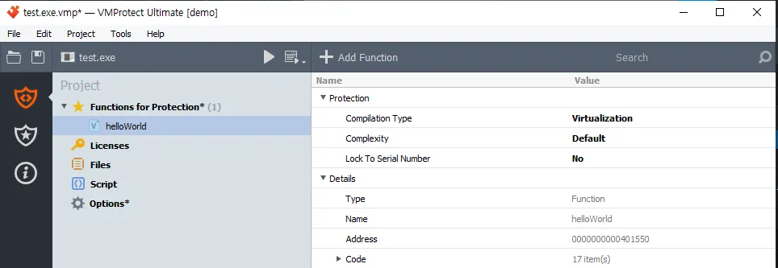
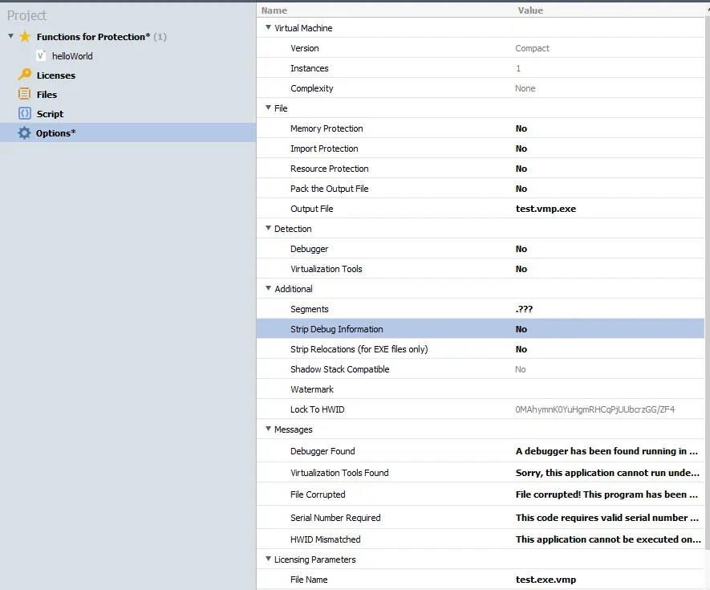
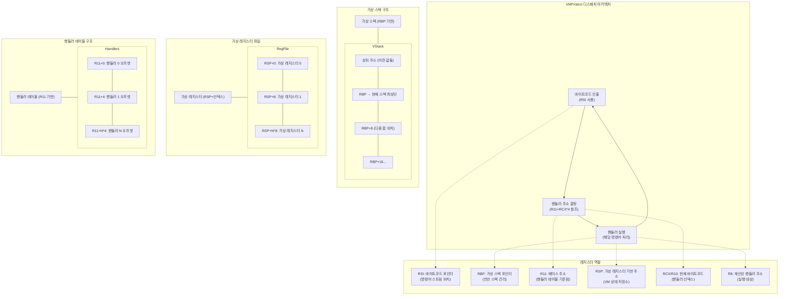

## 실습 진행

---

[VMProtect Software](https://vmpsoft.com/files)

간단한 코드에 VMProtect Demo를 적용시켜 분석해보고자 한다.

```c
#include <stdio.h>
void helloWorld() {
    printf("Hello World!");
}

void main(int argc, char *argv[])
{
    printf("Main Function");
    helloWorld();
}
```

해당 파일을 위에 Build 자료 참고하여 exe파일로 만들어준다.

그 후 VMProtect에 들어가서 해당 .exe파일을 선택해준 후,



우선 Add Function 버튼을 눌러 helloWorld라는 function을 추가해준다.



option들도 디버깅에 용이하게 변경해준다.

그 후 컴파일 버튼(재생 플레이어처럼 생긴 버튼)을 눌러서 파일을 생성해준다.

실행시키면 다음과 같은 창이 뜨긴 하지만 잘 출력된다.


(터미널이 아니라 직접 실행시키니 출력문이 안 보일 정도로 빨리 꺼짐 → 따로 추가적인 함수를 넣어줘야 바로 안 꺼지고 보인다는 자료를 확인한 적 있음. 하지만 최대한 자료와 같은 환경 구성하기 위해 추가하지 않음.)

*참고) IDA로 까려고 할 때 자꾸 .exe.id2에서 권한 거부 문제가 발생했는데 바탕화면에서 여니까 되었음. (IDA 권한 줘서 했었는데도 왜 안 됐지..)


IDA 화면. 왼쪽에 보면 분명히 나는 함수 하나만 짰는데 어마무시하게 많은 서브루틴 함수들이 존재함을 확인할 수 있다.

## 분석

우선 VMProtect가 적용되지 않은 바이너리를 확인해보자.


심볼도 다 살아있다.

이제 String 찾기로 VMProtect에서 Main Fuction이라는 문자열을 찾아보자.

*참고2)

- IDA가 웃긴게, Main이라고 치면 아무것도 안 나오고 Full Text로 쳐야 확인이 된다. Main Functio 도 안 됨,,


적용된 바이너리는 다음과 같다.


main이라는 함수명은 직접 변경한 것이다.


Non VMProtect


VMProtect

PE파일에서는 외부 함수를 호출하기 위해서 Import Address Table(IAT)를 이용하여 실제 주소들을 채워넣는다.

`__imp_printf` 는 External symbol에 존재하며, 이는 프로그램이 외부에서 가져와 사용하는 함수나 변수를 의미하며 IAT에 존재하는 외부 함수 주소를 가리킨다.

하지만 VMProtect가 적용된 printf함수는 함수 포인터로만 존재한다. 런타임 시에 동적으로 해당 함수의 주소가 채워질 가능성이 존재한다. 이는 동적 분석을 통해 확인해보아야 한다.

이렇게 가상화가 적용되지 않은 부분들도 변경된다. 하지만 기본적인 함수 틀은 모두 살아있는 모습이다.

Main으로 추정되는 함수를 찾았다. 하지만 문제가 발생했는데,


JUMPOUT 오류가 발생했다.

[IDA "sp-analysis failed" 에러 해결 방법](https://keyme2003.tistory.com/entry/test)


---

이 밑에 내용들은 정리 필요

## VMProtect 동작 원리

## VMProtect의 핵심 실행 메커니즘

VMProtect는 **인터프리터 방식의 가상 머신**으로 동작합니다. 가상화된 명령어는 즉시 실행되지만, 원래 x86 명령어와는 전혀 다른 방식으로 처리됩니다:

1. **바이트코드 실시간 해석**:
    - 각 바이트코드 명령어는 읽혀지는 즉시 해당 핸들러에 의해 실행됩니다
    - 이는 JIT(Just-In-Time) 컴파일이 아닌, 순수 인터프리터 방식입니다
2. **가상 컨텍스트 유지**:
    - RSP 기반 메모리 영역에 가상 레지스터 상태가 유지됩니다
    - RBP를 통해 접근하는 가상 스택은 연산 중간값을 저장합니다

### 디스패처

디스패처(Dispatcher)는 가상 머신 보호 체계의 핵심 구성요소로, 다음과 같은 중요 기능을 수행합니다:

1. **명령어 해석**: 암호화된 바이트코드를 하나씩 읽어 어떤 VM 핸들러를 실행할지 결정합니다.
2. **제어 흐름 관리**: 각 바이트코드 명령어 실행 후 다음 명령어로 제어를 전달합니다.
3. **컨텍스트 유지**: 가상 레지스터, 가상 플래그 등 VM의 상태를 유지합니다.


해당 코드에서 `add rsi,1` 까지 실행시켰을 때, RSI 레지스터 값을 확인해보면 `0x4a7a3d` 이다.


해당 위치를 IDA로 확인해보면 암호화 되어있는 부분임을 확인할 수 있다.

switch문


실질적으론 계산된 R8 레지스터에 있는 위치로 이동한다.

**(Claude.ai)**



- RSI: 현재 실행 중인 바이트코드 위치를 가리키는 명령어 포인터
- RBP: 가상 연산을 위한 스택 관리
- R11: 핸들러 테이블과 코드의 기준점
- RSP: 가상 레지스터 파일의 기반 주소
- RCX/R10: 현재 해석 중인 바이트코드 값
- R8: 실행할 핸들러의 계산된 주소