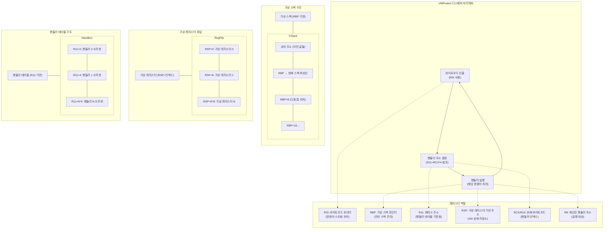

해당 프로젝트 전, Android Mobile Hacking 프로젝트를 진행한 경험이 있다. 프로젝트 막바지에 버그헌팅을 목표로 삼았기에 버그헌팅 프로그램에 참여하여 상용앱을 분석해보았는데 이때가 첫 리얼월드에 대한 경험이였다. 하지만 가장 처음으로 가로막히게 된 부분은 디버거 탐지와 난독화였고, 이를 계기로 해당 보호 기법들에 대해 분석해보게 되었다.

<br />
상용 프로그램들에는 자신들의 프로그램의 소스코드, 취약점 등을 보호하기 위한 목적으로 'Packer'라는 것을 사용한다.
<br />

## Packer

실행 파일 패커는 원본 프로그램의 코드와 데이터를 압축하거나 암호화하는 도구이다. 패커는 원본 실행 파일을 래핑하여 새로운 실행 파일을 생성하며, 프로그램 실행 시 원본 코드를 메모리에서 동적으로 복원한다. 이는 파일 크기 감소, 로딩 시간 단축, 코드 보호 등 다양한 목적으로 사용된다.

<br />
Packer들이 가진 기능은 다양한데, 해당 분석에서는 코드 가상화 및 디버거 탐지에 대해 분석해본다.
<br />

## VMProtect 코드 가상화 분석

---

[VMProtect Software](https://vmpsoft.com/files)
<br />
VMProtect에서는 Demo버전을 배포하고 있다. 해당 버전을 이용하여 예제 코드를 작성하여 실제 적용시켰을 때 어떤 식으로 코드 가상화가 이루어지는지 분석해보자.


<br />

**예제 코드**
```c
#include <stdio.h>
void helloWorld() {
    printf("Hello World!");
}

void main(int argc, char *argv[])
{
    printf("Main Function");
    helloWorld();
}
```
예제 코드를 작성한 이후, visual studio를 이용하여 exe 파일을 만들어준다. 버전은 2022를 사용한다.

간단히 기술하면 
<br />
[빌드에서 '솔루션 정리' -> 프로젝트 -> '프로젝트명' 속성 -> 구성에서 Release 선택 -> 저장 -> 빌드 에서 '솔루션 다시 빌드' -> 일괄 빌드 (Release 적힌 구성 둘 다 체크)]
<br />
이렇게 진행해준 후, Release 혹은 x64 파일에 들어가보면 exe 파일이 있다.

그 후 VMProtect에 들어가서 해당 .exe파일을 선택해준 후,


우선 Add Function 버튼을 눌러 helloWorld라는 function을 추가해준다.


option들도 디버깅에 용이하게 변경해준다.

그 후 컴파일 버튼(재생 플레이어처럼 생긴 버튼)을 눌러서 파일을 생성해준다.

실행시키면 다음과 같은 창이 뜨긴 하지만 잘 출력된다.


(터미널이 아니라 직접 실행시키니 출력문이 안 보일 정도로 빨리 꺼짐 → 따로 추가적인 함수를 넣어줘야 바로 안 꺼지고 보인다는 자료를 확인한 적 있음. 하지만 최대한 자료와 같은 환경 구성하기 위해 추가하지 않음.)

*참고) IDA로 까려고 할 때 자꾸 .exe.id2에서 권한 거부 문제가 발생했는데 바탕화면에서 여니까 되었음. (IDA 권한 줘서 했었는데도 왜 안 됐지..)


IDA 화면. 왼쪽에 보면 분명히 나는 함수 하나만 짰는데 어마무시하게 많은 서브루틴 함수들이 존재함을 확인할 수 있다.

## 분석
---

우선 VMProtect가 적용되지 않은 바이너리를 확인해보자.


심볼도 다 살아있다.

이제 String 찾기로 VMProtect에서 Main Fuction이라는 문자열을 찾아보자.

*참고2)

- IDA가 웃긴게, Main이라고 치면 아무것도 안 나오고 Full Text로 쳐야 확인이 된다. Main Functio 도 안 됨,,


적용된 바이너리는 다음과 같다.


main이라는 함수명은 직접 변경한 것이다.

 | 
Non VMProtect


VMProtect

PE파일에서는 외부 함수를 호출하기 위해서 Import Address Table(IAT)를 이용하여 실제 주소들을 채워넣는다.

`__imp_printf` 는 External symbol에 존재하며, 이는 프로그램이 외부에서 가져와 사용하는 함수나 변수를 의미하며 IAT에 존재하는 외부 함수 주소를 가리킨다.

하지만 VMProtect가 적용된 printf함수는 함수 포인터로만 존재한다. 런타임 시에 동적으로 해당 함수의 주소가 채워질 가능성이 존재한다. 이는 동적 분석을 통해 확인해보아야 한다.

이렇게 가상화가 적용되지 않은 부분들도 변경된다. 하지만 기본적인 함수 틀은 모두 살아있는 모습이다.

## 코드 가상화 분석
가상화 되어 있는 함수를 확인하였으므로 해당 함수에 어떤 식으로 코드가 가상화되어 동작하는지 분석해보자.
<br />

### VM Entry
가상화가 적용된 코드에는 VM Entry라는 부분이 존재한다. 뒤에 기술하겠지만, 코드 가상화 기술은 디스패처 중심으로 움직인다. 이때 디스패처를 통해 동작되는 가상화된 코드만의 핸들러들을 수행하기 위해 진입 직전 모든 정보를 저장해둔다.

가상화가 시작되는 부분이 바로 VM Entry이며, 특징으로는 현재의 모든 레지스터 정보를 push 해두는 코드 흐름을 가지고 있다.

## 동적 분석

---

Windbg를 이용하여 실제 런타임시에 어떻게 코드가 진행되는지 분석해보자.

### VM Entry


우선 Main함수가 실행되는 부분을 찾고 helloWorld() 함수가 call 되는 시점을 따라 들어가본다.


다시 한 번 특정 주소가 호출되는데, 해당 주소를 따라가면


현재 레지스터의 상황을 모두 정리하는 걸 확인할 수 있고, 이를 VM Entry라고 한다. 

기존의 정보를 모두 저장한 뒤 가상화를 진행하고, 가상화가 종료된 이후 저장된 정보를 다시 가져와 이전 코드 흐름을 이어서 진행한다.

VM Entry 초기화 부분에서 실행되는 동작들은 크게 6가지로 분류해볼 수 있다. 

아래 코드들은 VMProtect의 난독화 기능 중 하나인 더미코드를 삭제하고 정리해둔 코드들이다.

1. 실제 CPU 레지스터 상태 저장

```bash
push r8
push rcx
push rbx
push rdi
push r15
push r13
push r10
push r11
push rax
```

원래 프로그램의 컨텍스트(레지스터 상태)를 보존하기 위해 레지스터들을 스택에 저장한다. 이는 VM이 종료된 뒤 기존의 실행 흐름으로 돌아갈 수 있도록 백업하는 절차이다.

2. CPU 플래그 및 추가 레지스터 저장

```bash
pushfq           // CPU 플래그 레지스터 저장
push rbp
push r9
push r14
push rsi
```

흐름에 따라 분류했기에 뒤에서 백업되는 추가적인 레지스터가 있으며, 플래그 레지스터도 동일하게 백업된다.

3. 가상 스택 및 레지스터 파일 초기화

```bash
mov rbx,0                     // rbx = 0 (기준값 설정)
mov qword ptr ss:[rsp],rbx    // 스택 초기화
mov esi,dword ptr ss:[rsp+80] // 기존 스택에서 특정 값 로드
inc esi                       // 증가
neg esi                       // 부호 반전
ror esi,1                     // 1비트 오른쪽 순환 이동
lea rsi,qword ptr ds:[rsi+rbx] // 최종 계산된 값을 rsi에 저장
```

`lea rsi,qword ptr ds:[rsi+rbx]` 실행 후 rsi


아직은 rsi에 어떤 값이 들어가는지 명확히 알 순 없다. 하지만 기존에 존재하던 스택에서 값을 불러오는 행위를 살펴보면 VIP(Virtual Instruction Pointer)의 초기값 계산일 가능성이 높다.

rsp+80에 보호된 코드의 시작 주소 참고 값이 저장되어 있고, 연산을 통해 실제 바이트코드 배열의 시작주소를 계산하면 최종적으로 VM이 읽을 가상 명령어의 첫 번째 위치를 가리키는 것이다. 하지만 아직 확신하긴 어려움으로 이후 이루어지는 코드의 흐름을 살펴보아야 한다.

4. 가상 스택 설정

```bash
mov rbp,rsp                      // 현재 스택 포인터 저장
lea r8,qword ptr ss:[rbp-200]    // 새로운 스택 위치 계산
mov rsp,r8                       // 스택 포인터 이동
```

가상환경에서 사용할 스택을 할당해준다.

5. 핸들러 테이블 베이스 주소 설정

```bash
lea r11,qword ptr ds:[5309D0]    // 핸들러 테이블 주소 로드
```

`lea r11,qword ptr ds:[5309D0]` 실행 후 R11


<br />
VM Entry에 진입 후 초기화 코드를 지나고나서  진행되는 코드를 쭉 살펴보면 계속 반복되는 코드 구간이 존재한다. 이때 우리는 한 가지 의심해봐야 하는 것이 있는데,

바로 코드 디스패처이다.

### 디스패처 (Dispatcher)

디스패처 (이하 DS)는 가상 머신 보호 체계의 핵심 구성요소이며 몇 가지 중요 기능을 수행한다.

1. 명령어 해석 : 암호화된 바이트코드를 하나씩 읽어 수행할 VM 핸들러를 결정한다.
2. 제어 흐름 관리 : 각 바이트코드 명령어 실행 후 다음 명령어로 제어를 전달한다.
3. 컨텍스트 유지 : 가상 레지스터, 가상 플래그 등을 사용하여 VM 상태를 유지한다.

즉 요약하자면 가상 환경에서 동작하는 가상 CPU라고 생각하면 된다. 그럼 해당 코드의 구조는 어떻게 될까?

반복되는 코드를 보면 다음과 같은데, 

```bash
movzx ecx,byte ptr ds:[rsi]                  | rsi:"虛b"
add rsi,1                                    | rsi:"虛b"
movsxd r8,dword ptr ds:[r11+rcx*4]           |
add r8,r11                                   |
jmp test.vmp.4F9513                          |

jmp r8                                       |
```

코드가 진행되면서 항상 해당 부분을 거쳐 분기하고, 다시 되돌아온다. 

**해당 디스패처 구조를 분석해보자.**

1. `movzx ecx,byte ptr ds:[rsi]`
    - 바이트 코드 값을 가져와 ecx에 저장한다. 즉, 바이트 코드는 핸들러 테이블의 인덱스 + a 라고 생각하면 된다.
2. `add rsi, 1`
    - 다음 바이트 코드를 가리킨다.
3. `movsxd r8,dword ptr ds:[r11+rcx*4]`
    - r11 레지스터는 핸들러 테이블의 시작 주소이다. 따라서 핸들러를 가리키는 r8은 r11을 기준으로 하여 rcx * 4 만큼 떨어진 곳의 값을 저장한다. → 이것도 일종의 인덱스 역할을 해주는 듯 하다. (확인필요. 뒤쪽에 add r8, r11이 또 있기 때문)
4. `add r8, r11`
    - r11+rcx*4 위치에 있던 값을 r11의 오프셋으로 활용해준다.
5. `jmp test.vmp.4F9513`
    - jmp r8로 가기 위한 더미 코드 (쓸모없는 분기)
6. `jmp r8`
    - 핸들러로 이동

각각의 기능을 상세히 기술하면 위와 같은데 아직은 이해하기 힘들다. 그러니 실제로 동작되는 과정을 예시로 살펴보자.

**eg)**

1. `movzx ecx,byte ptr ds:[rsi]` 

rsi = 0x4a7a74


실행 후 : rcx = 0xfa

2. `add rsi, 1`

실행 후 : rsi = 0x4a7a75

3. `movsxd r8,dword ptr ds:[r11+rcx*4]`

r11 = 00000000004F49B8

r11 + rcx * 4 = 0x4F4DA0


실행 후 : r8 = 0000000000001160

4. `add r8, r11`

실행 후 : r8 = 00000000004F5B18

5. `jmp r8`

0x4F5B18로 jmp.


핸들러 수행.

여기까지 온 후 레지스터 상태.


이를 실제로 구조화해보면 다음처럼 표현할 수 있다.



- RSI: 현재 실행 중인 바이트코드 위치를 가리키는 명령어 포인터
- RBP: 가상 연산을 위한 스택 관리
- R11: 핸들러 테이블과 코드의 기준점
- RSP: 가상 레지스터 파일의 기반 주소
- RCX/R10: 현재 해석 중인 바이트코드 값
- R8: 실행할 핸들러의 계산된 주소

IDA에서도 해당 부분을 확인해보자.


helloWorld()의 가상화된 코드. IDA를 이용하여 그래프로 표현해보았다.

빨간색으로 밑줄 친 부분이 디스패처의 switch부분이다. (앞으론 저렇게 특이점으로 보이는 곳부터 선 분석 해보아야겠다.)


끝부분도 확인해보면


<br />
위의 스위치 문으로 되돌아가게 해주는 분기문이다.